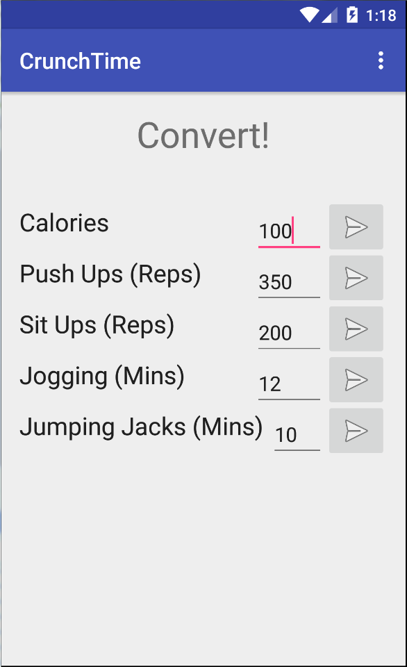

# PROG 01: Crunch Time

This app converts values from Calories to the number of reps of an exercise that the user must perform to burn that amount of Calories. The user can also convert from the amount of reps of an exercise to the number of Calories burned, as well as the equivalent number of reps of another exercise.

## Authors

Tony Chen ([sirtony@berkeley.edu](mailto:sirtony@berkeley.edu))

## Demo Video

See [CrunchTime] (https://youtu.be/aR_y3qFPeP8)

## Screenshots

## Acknowledgments

* Hat tip to anyone who's code was used
* Any other support

*Feel free to enhance your README. For Markdown syntax, see [the GitHub Guides](https://guides.github.com/features/mastering-markdown/). Remove this line in your submission.*
